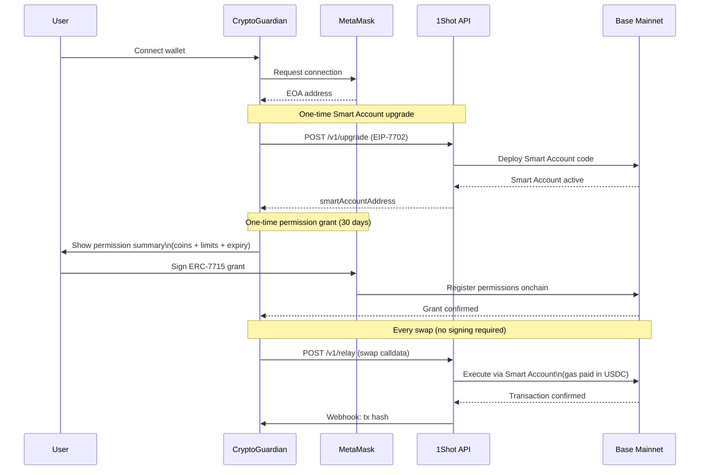

# CryptoGuardian 🛡️

> AI-powered portfolio protection agent that monitors 10 volatile EVM coins simultaneously — auto-swapping to USDC when danger is detected, buying on opportunity, all without you lifting a finger.

[](https://github.com/YOUR_USERNAME/Crypto-Guardian/actions/workflows/ci.yml)


Built for the **MetaMask Smart Accounts Kit × 1Shot API × Venice AI Hackathon**

---

## What Is CryptoGuardian?

Most people find out their portfolio crashed hours after it happened — when it's too late. CryptoGuardian fixes that.

Every 15 minutes, Venice AI acts as your personal crypto guru. It scans prices, reads breaking news, and checks market sentiment across all your coins at once. When it detects danger — a flash crash, a hack announcement, extreme fear — it automatically swaps that coin to USDC using your MetaMask Smart Account. No popups. No gas fees to worry about. No manual signing.

When it spots a real opportunity — positive momentum backed by news — it can buy more, within the exact limits you set.

**You set the rules once. CryptoGuardian enforces them forever.**

---

## Hackathon Tracks

| Track                 | Prize  | How                                 |
| --------------------- | ------ | ----------------------------------- |
| 🤖 Best Agent         | $3,000 | Multi-coin autonomous AI agent loop |
| 🧠 Best Venice AI     | $3,000 | Venice is the entire analysis brain |
| ⛽ Best 1Shot Relayer | $1,000 | All gas paid in USDC via 1Shot      |
| 📣 Social Media       | $500   | Build journey tagged @MetaMaskDev   |

**Total potential: $7,500**

---

## How It Works

### System Architecture

```mermaid
graph TB
    subgraph Frontend["Frontend (Next.js 14)"]
        LP[Landing Page]
        SP[Setup Page]
        DB[Dashboard]
        CD[Coin Detail]
        ST[Settings]
    end

    subgraph API["API Routes (Next.js)"]
        AG[/api/agent]
        MD[/api/market-data]
        VA[/api/venice-analysis]
        ES[/api/execute-swap]
        WH[/api/webhooks]
    end

    subgraph External["External Services"]
        CG[CoinGecko API\nPrices + Changes]
        FG[Fear & Greed API\nalternative.me]
        VN[Venice AI\nllama-3.3-70b]
        MM[MetaMask\nSmart Account]
        OS[1Shot Relayer\nGas in USDC]
        UN[Uniswap v3\nBase Mainnet]
    end

    DB -->|poll every 15min| AG
    AG --> MD
    AG --> VA
    AG --> ES
    MD --> CG
    MD --> FG
    VA --> VN
    ES --> UN
    ES --> OS
    OS -->|webhook| WH
    MM -->|permissions| AG

    style Frontend fill:#1e3a5f,stroke:#3b82f6
    style API fill:#1a2e1a,stroke:#22c55e
    style External fill:#2d1a1a,stroke:#ef4444
```

---

### Agent Loop (Every 15 Minutes)

```mermaid
flowchart TD
    START([▶ Agent Loop Starts]) --> FETCH

    FETCH[1. Fetch all coin prices\nCoinGecko API\n1hr + 24hr % change] --> FEAR

    FEAR[2. Fetch Fear & Greed Index\nalternative.me] --> NEWS

    NEWS[3. Venice AI web_search\nLatest news per coin\nRuns in parallel] --> ANALYZE

    ANALYZE[4. Venice AI Analysis\nllama-3.3-70b\nAll market data in one prompt] --> PARSE

    PARSE[5. Parse Response\nVerdict per coin\nPriority coin + reasoning] --> CHECK

    CHECK{6. Check User Rules\nLimits · Sensitivity · Paused?}

    CHECK -->|Allowed| ACTION
    CHECK -->|Blocked| SKIP

    ACTION{7. What action?}
    ACTION -->|DANGER → SELL| SWAP_SELL
    ACTION -->|OPPORTUNITY → BUY| SWAP_BUY
    ACTION -->|CAUTION/NEUTRAL| SKIP

    SWAP_SELL[8a. Build sell calldata\nToken → USDC\nUniswap v3] --> RELAY
    SWAP_BUY[8b. Build buy calldata\nUSDC → Token\nUniswap v3] --> RELAY

    RELAY[9. Submit to 1Shot Relayer\nGas paid in USDC\nNo ETH needed] --> WEBHOOK

    WEBHOOK[10. Webhook confirms tx\nBasescan link logged] --> LOG

    SKIP[Log: Skipped\nWith reason] --> LOG

    LOG[11. Update Dashboard\nVerdict grid · AI reasoning\nAction feed] --> WAIT

    WAIT([⏱ Wait 15 minutes]) --> START

    style START fill:#1e3a5f,stroke:#3b82f6
    style ANALYZE fill:#3b1a5f,stroke:#a855f7
    style RELAY fill:#1a3b1a,stroke:#22c55e
    style SKIP fill:#2d2d1a,stroke:#eab308
    style SWAP_SELL fill:#3b1a1a,stroke:#ef4444
    style SWAP_BUY fill:#1a3b1a,stroke:#22c55e
```



---

### MetaMask Smart Account Permission Flow



---

### Venice AI Analysis Flow

```mermaid
flowchart LR
    subgraph Inputs["Market Inputs"]
        P[Prices\n10 coins]
        F[Fear & Greed\nIndex 0-100]
        N[News\nper coin]
        S[User Settings\nrisk sensitivity]
    end

    subgraph Venice["Venice AI llama-3.3-70b"]
        WS[Call 1: web_search\nLatest news per coin\nParallelized]
        AN[Call 2: Analysis\nSystem prompt:\nSenior crypto analyst\n15yr experience]
    end

    subgraph Output["Structured Response"]
        VD[Verdicts per coin\nDANGER CAUTION\nNEUTRAL OPPORTUNITY]
        PC[Priority Coin\nNeeds action NOW]
        RE[Reasoning\n2-sentence guru insight]
    end

    P --> AN
    F --> AN
    N --> WS --> AN
    S --> AN
    AN --> VD
    AN --> PC
    AN --> RE

    style Venice fill:#3b1a5f,stroke:#a855f7
    style Inputs fill:#1e3a5f,stroke:#3b82f6
    style Output fill:#1a3b1a,stroke:#22c55e
```



---

## Verdict System

| Verdict        | Color  | Meaning                                      | Action                        |
| -------------- | ------ | -------------------------------------------- | ----------------------------- |
| 🔴 DANGER      | Red    | Immediate risk — drop + bad news + high fear | Auto-swap to USDC             |
| 🟡 CAUTION     | Yellow | Warning signs — watch closely                | Log, no action (conservative) |
| ⚪ NEUTRAL     | Gray   | No significant movement                      | Hold                          |
| 🟢 OPPORTUNITY | Green  | Strong momentum + positive news              | Buy more (if aggressive mode) |

---

## Tech Stack

| Layer      | Technology                                        |
| ---------- | ------------------------------------------------- |
| Framework  | Next.js 16, TypeScript 5, TailwindCSS 4           |
| Wallet     | MetaMask Smart Accounts Kit (ERC-7715, EIP-7702)  |
| Gas        | 1Shot Permissionless Relayer — USDC gas           |
| AI Brain   | Venice AI API — `llama-3.3-70b` + web search      |
| Prices     | CoinGecko API (free tier)                         |
| Sentiment  | Fear & Greed Index (alternative.me, free)         |
| Swaps      | Uniswap v3 on Base Mainnet                        |
| Chain      | Base Mainnet (chainId: 8453)                      |
| Safe Asset | USDC `0x833589fCD6eDb6E08f4c7C32D4f71b54bdA02913` |
| State      | Zustand (client) + TanStack Query (server)        |
| Charts     | Recharts                                          |

---

## Coins Monitored

All on Base Mainnet — user toggles which ones to protect:

| Symbol | Name               | Type      |
| ------ | ------------------ | --------- |
| ETH    | Ethereum           | Blue chip |
| MATIC  | Polygon            | L2        |
| ARB    | Arbitrum           | L2        |
| OP     | Optimism           | L2        |
| LINK   | Chainlink          | Oracle    |
| UNI    | Uniswap            | DeFi      |
| AAVE   | Aave               | DeFi      |
| DOGE   | Dogecoin (wrapped) | Meme      |
| SHIB   | Shiba Inu          | Meme      |
| PEPE   | Pepe               | Meme      |

---

## Project Structure

```
src/
├── app/
│   ├── page.tsx                  # Landing page
│   ├── setup/page.tsx            # Wallet connect + coin selection + permissions
│   ├── dashboard/page.tsx        # Live verdict grid + agent feed
│   ├── coin/[symbol]/page.tsx    # Coin detail + history
│   ├── settings/page.tsx         # Adjust limits + manage permissions
│   └── api/
│       ├── agent/route.ts        # Agent loop trigger (cron every 15min)
│       ├── market-data/route.ts  # CoinGecko + Fear/Greed
│       ├── venice-analysis/      # Venice AI calls
│       ├── execute-swap/         # Build + relay swap via 1Shot
│       └── webhooks/             # 1Shot transaction webhooks
├── lib/
│   ├── types.ts                  # All shared TypeScript types
│   ├── coins.ts                  # Coin config + Base addresses
│   ├── market-data.ts            # CoinGecko + Fear/Greed fetchers
│   ├── venice.ts                 # Venice AI API client
│   ├── agent-engine.ts           # Main 15-min loop orchestrator
│   ├── smart-accounts.ts         # MetaMask ERC-7715 permissions
│   ├── oneshot.ts                # 1Shot Relayer client
│   ├── uniswap.ts                # Uniswap v3 swap builder
│   └── utils.ts                  # Formatters + helpers
├── store/
│   ├── coinStore.ts              # User coin selections + limits (persisted)
│   └── agentStore.ts             # Live verdicts + action feed
└── components/                   # UI components (see docs/)
```

---

## Quick Start

```bash
# 1. Clone
git clone https://github.com/YOUR_USERNAME/Crypto-Guardian.git
cd Crypto-Guardian

# 2. Install dependencies (pnpm required)
pnpm install

# 3. Set up environment
cp .env.example .env.local
# Fill in: VENICE_API_KEY, ONESHOT_API_KEY, NEXT_PUBLIC_WALLET_CONNECT_ID

# 4. Run locally
pnpm dev
# → http://localhost:3000
```

---

## Available Scripts

```bash
pnpm dev          # Start dev server with Turbopack
pnpm build        # Production build
pnpm start        # Start production server
pnpm type-check   # TypeScript check (no emit)
pnpm lint         # ESLint across src/
pnpm lint:fix     # ESLint with auto-fix
pnpm format       # Prettier write all files
pnpm format:check # Prettier check (used in CI)
pnpm check        # Run type-check + lint + format:check
```

---

## CI Pipeline

Every push and pull request to `main` or `dev` runs:

```
push/PR → quality job → build job
             │                │
             ├─ type-check    └─ next build
             ├─ eslint             (artifacts uploaded)
             └─ prettier check
```

See [`.github/workflows/ci.yml`](.github/workflows/ci.yml)

---

## Environment Variables

```bash
# Required — server only (never exposed to client)
VENICE_API_KEY=                    # venice.ai
ONESHOT_API_KEY=                   # 1shotapi.com
ONESHOT_WEBHOOK_SECRET=            # for webhook HMAC verification

# Required — public (safe to expose)
NEXT_PUBLIC_WALLET_CONNECT_ID=     # cloud.walletconnect.com
NEXT_PUBLIC_CHAIN_ID=8453
NEXT_PUBLIC_USDC_ADDRESS=0x833589fCD6eDb6E08f4c7C32D4f71b54bdA02913
NEXT_PUBLIC_UNISWAP_ROUTER=0x2626664c2603336E57B271c5C0b26F421741e481
NEXT_PUBLIC_APP_URL=https://your-app.vercel.app
```

See [`.env.example`](.env.example) for the full template.

---

## Deployment

**Vercel (recommended):**

1. Push to GitHub
2. Import at [vercel.com](https://vercel.com)
3. Add all env vars in Vercel project settings
4. Deploy — Vercel Cron calls `/api/agent` every 15 minutes automatically

**1Shot Webhook:**
Set your webhook URL in 1Shot dashboard:

```
https://your-app.vercel.app/api/webhooks
```

---

## Documentation

Full planning docs in [`/docs`](./docs/):

| Doc                                                        | Contents                        |
| ---------------------------------------------------------- | ------------------------------- |
| [00-project-overview](docs/00-project-overview.md)         | Mission + hackathon tracks      |
| [01-tech-stack](docs/01-tech-stack.md)                     | All tools with install commands |
| [02-architecture](docs/02-architecture.md)                 | Detailed system diagrams        |
| [03-project-structure](docs/03-project-structure.md)       | Full file tree                  |
| [04-build-plan](docs/04-build-plan.md)                     | 5-day build phases              |
| [05-pages-and-components](docs/05-pages-and-components.md) | Every page + component spec     |
| [06-api-routes](docs/06-api-routes.md)                     | API contracts                   |
| [07-lib-modules](docs/07-lib-modules.md)                   | Library module signatures       |
| [08-coin-config](docs/08-coin-config.md)                   | Token addresses + Uniswap pools |
| [09-env-and-deployment](docs/09-env-and-deployment.md)     | Env setup + Vercel              |
| [10-venice-prompts](docs/10-venice-prompts.md)             | AI prompts + response parsing   |
| [11-smart-accounts-guide](docs/11-smart-accounts-guide.md) | MetaMask EIP-7702 + ERC-7715    |
| [12-demo-script](docs/12-demo-script.md)                   | 3-minute hackathon video script |

---

## License

MIT — see [LICENSE](LICENSE)
